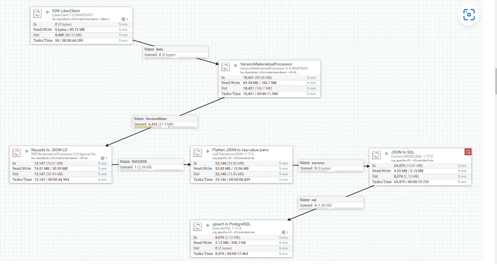

This sections provides an overview of how data consumer can replicate data to different backend systems.

## Triple stores

<p align="center"></p>

The LDES2Service toolbox contains an "RDF4J Put" processor, allowing to ingest members in triple stores that support the RDF4J API.

[In this Github repo](https://github.com/samuvack/ldes-grar), a docker-compose file with the configuration of **GraphDB** and Apache NiFi. A data flow is configured in Apache NiFi to replicate LDES members into GraphDB. There is already a preconfigured [Apache Nifi workflow file](https://github.com/samuvack/ldes-grar/blob/main/NiFi_Flow.json) available. Execute the following steps to start replicating data into GraphDB.

1. Start Docker

2. Make sure port `8433` (Apache Nifi) and `7200` (GraphDB) are accessible

3. Create a local docker-compose.yml file with [the following good-to-go configuration](https://github.com/samuvack/ldes-grar/blob/main/docker-compose.yml)
4. Run `docker-compose up --build` to start the Apache Nifi and GraphDB containers

5. Configure an LDES endpoint in the LDES Client in Apache Nifi

6. Go to your GraphDB database via http://localhost:7200/

7. Create a [repo in GraphDB](https://graphdb.ontotext.com/documentation/10.0/creating-a-repository.html#:~:text=To%20manage%20your%20repositories%2C%20go,templates%2F%20in%20the%20GraphDB%20distribution.)

8. Start the Apache NiFi workflow

9. LDES members will be replicated one by one into your GraphDB

{: .highlight }
You can find more information in [this article](https://medium.com/towards-artificial-intelligence/real-time-data-linkage-via-linked-data-event-streams-e1aab3090b40)

## PostgreSQL & TimescaleDB

<p align="center"></p>

In this [Github repo](https://github.com/samuvack/LDES2TimescaleDB), you will find a docker file with the configuration of TimescaleDB and Apache NiFi. A workflow is configured in Apache NiFi to replicate LDES members into TimescaleDB. You will find an Apache NiFi configuration file containing the necessary data flow. This Apache NiFi data flow works also for storing LDES members in a PostgreSQL database.

1. Start Docker

2. Make sure port `8433`, `8001` and `8002` are accessible

3. Create a local docker-compose.yml file with [the following good-to-go configuration](https://github.com/samuvack/LDES2TimescaleDB/blob/main/docker-compose.yml)

4. Run `docker-compose up --build`

5. import the workflow in Apache NiFi (localhost:8443) via [this configuration file](https://github.com/samuvack/LDES2TimescaleDB/blob/main/iow_LDES_timescale.json)

6. Configure an LDES endpoint in the LDES Client

7. Go to your PgAdmin to access the TimescaleDB database via localhost:8002/

8. [Create a database in TimescaleDB](https://docs.timescale.com/getting-started/latest/)

9. Start the Apache NiFi workflow

10. LDES members will be replicated one by one into your TimescaleDB



{: .highlight }
You can find more information in [this article](https://medium.com/towards-artificial-intelligence/linked-data-event-streams-and-timescaledb-for-real-time-timeseries-data-management-9e82ba336f82)

## PowerBI

<p align="center"></p>

In this [Github repo](https://github.com/Informatievlaanderen/VSDS-LDESDemo/tree/master/geoserver), you will find a docker file with the configuration of PostgreSQL, Apache NiFi and a configuration file for PowerBI.

A workflow is configured in Apache NiFi to replicate the LDES members into PostgreSQL. You will find an Apache NiFi configuration file containing the necessary data flow.

1. Start Docker

2. Make sure port `8433`, `8001` and `8002` are accessible

3. Create a local docker-compose.yml file with [the following good-to-go configuration](https://github.com/Informatievlaanderen/VSDS-LDESDemo/blob/master/geoserver/docker-compose.yml)

4. Run `docker-compose up --build`

5. import the workflow in Apache NiFi (localhost:8443) via this [configuration file](https://github.com/Informatievlaanderen/VSDS-LDESDemo/blob/master/geoserver/Gipod2GeoServer.json)

6. Configure an LDES endpoint in the LDES Client

7. Go to your PgAdmin to access your PostgreSQL database via localhost:8002/

8. [Create a database in PostgreSQL](https://www.tutorialspoint.com/postgresql/postgresql_create_database.htm)

9. Start the Apache NiFi workflow

10. LDES members will be replicated one by one into your PostgreSQL

11. [Link PostgreSQL to Geoserver](https://docs.geoserver.org/latest/en/user/data/database/postgis.html)

{: .highlight }
You can find more information in [this article](https://medium.com/p/5cd8379d32)

## GeoServer

<p align="center"></p>

In this [Github repo](https://github.com/Informatievlaanderen/VSDS-LDESDemo/tree/master/geoserver), you will find a docker file with the configuration of PostgreSQL, Apache NiFi and Geoserver.

A data flow is configured in Apache NiFi to convert these data streams into PostgreSQL. You will find an Apache NiFi configuration file containing the necessary data flow. This Apache NiFi data flow works also for storing LDES members in a PostgreSQL database.

1. Install [Docker](https://www.docker.com/)

2. Make sure port 8433, 8001 and 8002 are accessible

3. Create a local docker-compose.yml file with [the following good-to-go configuration](https://github.com/Informatievlaanderen/VSDS-LDESDemo/blob/master/geoserver/docker-compose.yml)

4. Run `docker-compose up --build`

5. import a data flow in Apache NiFi (localhost:8443) via this configuration file
6. Assign and LDES endpoint in the LDES client

7. Go to PgAdmin to access your PostgreSQL database via localhost:8002/

8. [Create a database in PostgreSQL](https://www.tutorialspoint.com/postgresql/postgresql_create_database.htm)

9. Start the Apache NiFi data flow

10. LDES members will be stored one by one in your PostgreSQL

11. [Link PostgreSQL to Geoserver](https://docs.geoserver.org/latest/en/user/data/database/postgis.html)


{: .highlight }
You can find more information in [this article](https://medium.com/geekculture/enriching-digital-twins-with-linked-data-event-streams-285630a02b82)

## LDES to QGIS

<p align="center"></p>

1. Follow the steps from [LDES to PostgreSQL/TimescaleDB](https://informatievlaanderen.github.iodocs/LDES2Service.html#data-science-ldes-to-postgresqltimescaledb)

2. Connecting QGIS to a PostgreSQL/PostGIS database lets you access and visualise your geo data in real-time.

{: .highlight }
You can find more information in [this article](https://medium.com/geekculture/visualizing-linked-data-event-streams-with-qgis-da25b6ccfc1b)

## Machine Learning (ML-LDES server)

```note
This is a prototype!!
```

<p align="center"></p>

In this [Github repo](https://github.com/samuvack/ML-LDES-server), you will find a docker file with the configuration of PostgreSQL and Apache NiFi.

A data flow is configured in Apache NiFi to convert these data streams into PostgreSQL. You will find an Apache NiFi configuration file containing the necessary data flow. This Apache NiFi data flow works also for storing LDES members in a PostgreSQL database.

1. Install Python requirements via: pip install -r requirements.txt

2. Install [Docker](https://www.docker.com/)

3. Make sure port 8433, 8001 and 5432 are accessible

4. Create a local docker-compose.yml file with [the following good-to-go configuration](https://github.com/samuvack/ML-LDES-server/blob/master/docker-compose.yml)

5. Run `docker-compose up --build`

6. import a data flow in Apache NiFi (localhost:8443) via this configuration file

7. Assign and LDES endpoint in the LDES client

8. Go to PgAdmin to access your TimescaleDB database (localhost:8002/)

9. [Create a database in TimescaleDB](https://www.tutorialspoint.com/postgresql/postgresql_create_database.htm)

10. Start the Apache NiFi data flow

11. LDES members will be stored one by one in your TimescaleDB

[Go to github repo for more info about ML-LDES server prototype](https://github.com/samuvack/ML-LDES-server)

{: .highlight }
You can find more information in [this](https://medium.com/towards-artificial-intelligence/incremental-machine-learning-for-linked-data-event-streams-e5441cb4c65a) and [this article](https://medium.com/towards-artificial-intelligence/forecasting-linked-data-event-streams-on-the-internet-of-water-826171085bae)
